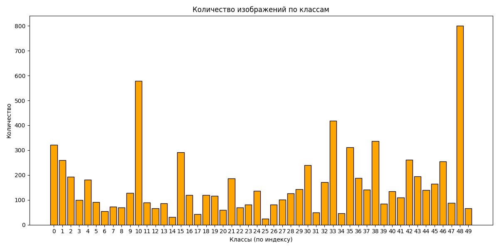
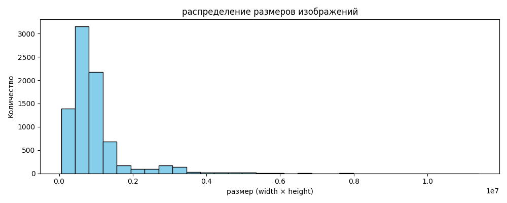
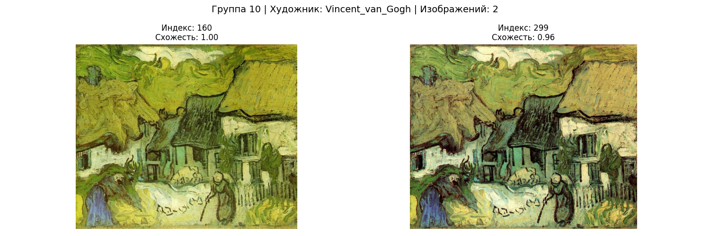
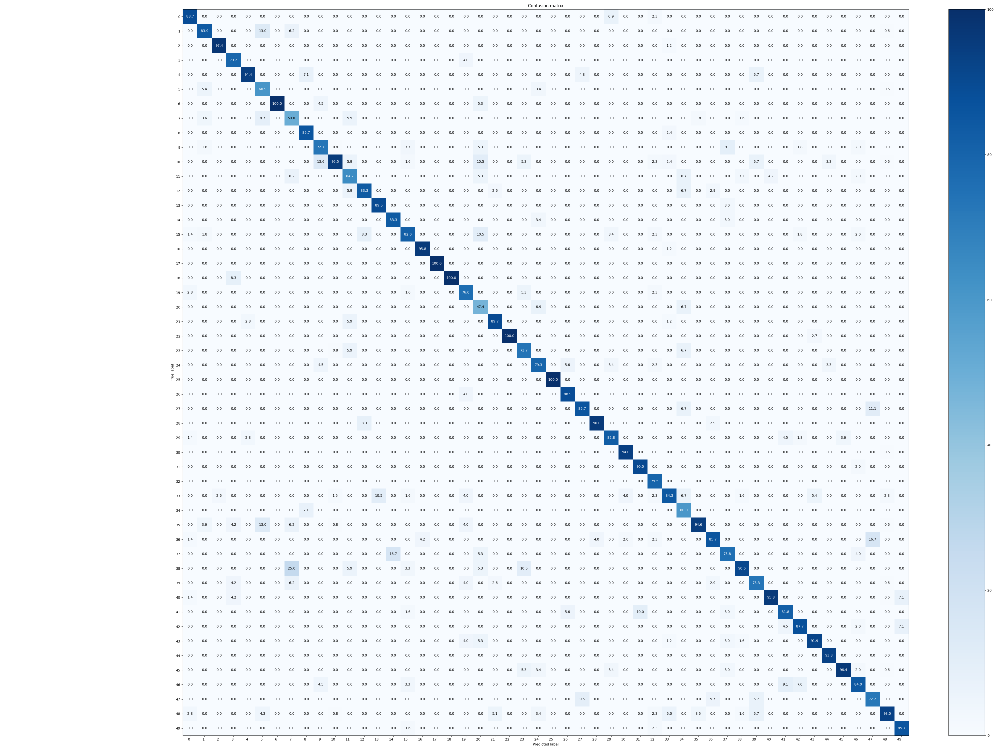

# Best artworks classifier

Это проект для демонстрации работы с датасетом [Best Artworks of All Time](https://www.kaggle.com/datasets/ikarus777/best-artworks-of-all-time).

Датасет содержит известные картины 50 различных художников.

## EDA

Перед началом работы было проведено исследование данных. Был обнаружен следующие факты:
- Существенный дисбаланс классов в датасете
- Есть различия в размерах изображений

Диаграмма распределения классов:

Было установлено, что минимальное число картин в классе - 24, максимальное - 877, среднее число картин в классе - 168.92.

Диаграмма распределения размеров изображений:

В датасете есть изображения, размер которых значительно больше среднего.

## Data preprocessing

Так как датасет был сильно аугментирован (особенно для классов с большим числом картин), было решено использовать CNN для нахождения схожих картин для уменьшения дисбаланса классов.

В ходе чистки были удалены некоторые дубликаты картин двух преобладающих классов (Vincent van Gogh и Edgar Degas).

Пример группы схожих картин:

## Training

Для обучения был использован алгоритм ResNet50 с использованием весов V2 из ImageNet.

В ходе обучения были использованы следующие параметры:
- Размер изображений - (512, 512)
- Размер батча - 64
- Количество эпох - 15
- Обучающая / тестовая выборки - 80% / 20%

Также использовалась аугментация обучающей выборки (RandomHorizontalFlip) для некоторых классов. Использование более сложных аугментаций привело к снижению качества модели.

Были проведены эксперименты с различными функциями потерь. 
- CrossEntropyLoss
- SoftF1Loss
- Комбинация CrossEntropyLoss и SoftF1Loss

## Results

Лучшая модель была обучена с использованием комбинации CrossEntropyLoss (30%) и SoftF1Loss (70%).

Метрики модели на тестовой выборке:
- Accuracy - 0.87
- F1 Score - 0.84
- Confidence - 0.89
- Precision - 0.86
- Recall - 0.83

Кривая обучения модели:

Матрица ошибок:

## Deployment

Был реализован сервис для получения предсказаний модели.

link: [best-artwork-classifier-site](https://best-artwork-classifier-website-91vq.onrender.com)

site repository: [click](https://github.com/cybertabyretka/best_artwork_classifier_website)
